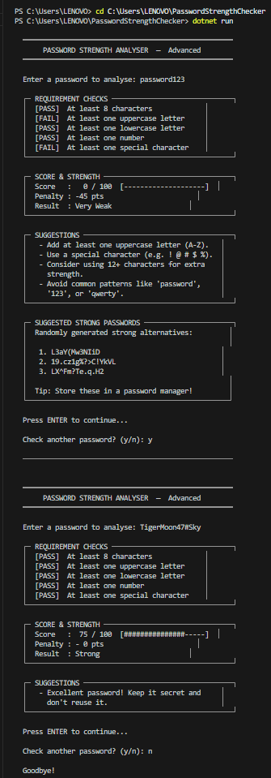

# Password Strength Analyser

A C# console application that analyses password strength, detects weak patterns, suggests improvements, and generates stronger password alternatives.

## Project Purpose

This project was built as a learning exercise while studying computer science.

The goal was to practice building a complete C# command-line application while applying concepts such as:

- Input validation
- Password security principles
- Program structure and modular design
- Random password generation
- Git version control and GitHub project documentation

It demonstrates how a CLI tool can analyse password strength, detect weak patterns, and generate stronger alternatives.

## Features

• Password strength scoring system  
• Detection of common weak patterns (e.g., "password", "123")  
• Suggestions to improve weak passwords  
• Automatic generation of strong password alternatives  
• ASCII-styled CLI interface  
• Looping system for analysing multiple passwords

## Technologies Used

- C#
- .NET SDK
- VS Code

## How It Works

The program checks whether a password meets important strength requirements such as length, character variety, and special characters.

It then calculates a score, applies deductions for common weak patterns, and displays the final strength level.

If the password is weak or medium, the program also generates 3 stronger password suggestions.

The user can continue checking multiple passwords without restarting the application.

## Example Test Inputs

- `password123`
- `Admin123`
- `MyPass@2026`
- `T!gerMoon47#Sky`

## How to Run

1. Open the project folder in VS Code
2. Open the terminal
3. Run:

```bash
dotnet run

## Sample Output

Example session using the CLI tool:

```text
Enter a password to analyse: password123

[PASS] At least 8 characters
[FAIL] At least one uppercase letter
[PASS] At least one lowercase letter
[PASS] At least one number
[FAIL] At least one special character

Score : 0 / 100
Result: Very Weak

Suggestions
- Add at least one uppercase letter (A-Z).
- Use a special character (e.g. ! @ # $ %).
- Consider using 12+ characters for extra strength.
- Avoid common patterns like 'password', '123', or 'qwerty'.

Suggested Strong Passwords
1. (example)
2. (example)
3. (example)

Press ENTER to continue...
Check another password? (y/n):
```
## Example Output



## Author

Gregory Ngatia 
