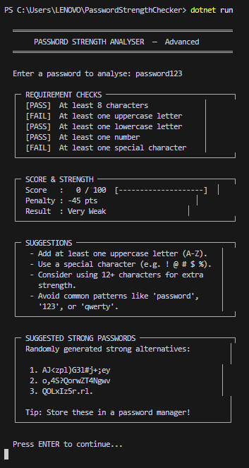
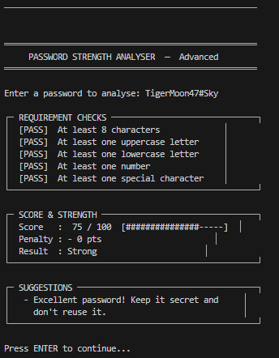

# PasswordStrengthAnalyser


A C# command-line tool that analyses password strength, detects weak patterns, and suggests stronger alternatives.
No external dependencies. Single file. Runs anywhere .NET is installed.

> Built as a portfolio project to practice C#, CLI development, input validation, and password security principles.

---

## Description

PasswordStrengthAnalyser takes any password input and runs it through a scoring system that checks for length, character variety, and common weak patterns. It gives you a score out of 100, explains what's wrong, and generates strong password alternatives when needed.

It's designed to be simple to use and educational — showing exactly why a password passes or fails each requirement.

---

## Features

| Feature | Description |
|---|---|
| Requirement Checks | Validates length, uppercase, lowercase, digits, and special characters |
| Strength Scoring | Calculates a score out of 100 based on complexity and length |
| Weak Pattern Detection | Penalises passwords containing common patterns like `password`, `123`, `qwerty` |
| Tailored Suggestions | Gives specific advice based on exactly what failed |
| Strong Password Generator | Generates 3 random strong alternatives when score is 60 or below |
| Visual Score Bar | Displays a `#` filled bar showing strength at a glance |
| Loop Support | Analyse multiple passwords in one session without restarting |

---

## Example Screenshots

### Weak Password Analysis


### Strong Password Analysis


---

## How It Works

The program runs each password through **5 requirement checks** — minimum length, uppercase, lowercase, digit, and special character — each worth 10 points.

Additional points are awarded for **longer passwords**: 10 points for 12+ characters, 20 for 16+, and 30 for 20+ characters. A **variety bonus** adds 5 points for each additional character category used beyond one.

A **weak pattern penalty** is then applied — any password containing common patterns like `password`, `123`, or `qwerty` loses 15 points per match.

The final score maps to a strength label: Very Weak, Weak, Medium, Strong, or Very Strong.

If the score is 60 or below, the tool generates **3 randomised strong passwords** — each guaranteed to contain uppercase, lowercase, a digit, and a special character, shuffled using a Fisher-Yates algorithm.

---

## Example Output
```
  ════════════════════════════════════════════════════
       PASSWORD STRENGTH ANALYSER  —  Advanced
  ════════════════════════════════════════════════════

  Enter a password to analyse: password123

  ┌─ REQUIREMENT CHECKS ──────────────────────────────┐
  │  [PASS]  At least 8 characters                   │
  │  [FAIL]  At least one uppercase letter           │
  │  [PASS]  At least one lowercase letter           │
  │  [PASS]  At least one number                     │
  │  [FAIL]  At least one special character          │
  └───────────────────────────────────────────────────┘

  ┌─ SCORE & STRENGTH ────────────────────────────────┐
  │  Score   :   0 / 100  [-----------------]        │
  │  Penalty : -45 pts                               │
  │  Result  : Very Weak                             │
  └───────────────────────────────────────────────────┘
```

---

## How to Run

**Requirements:** [.NET SDK](https://dotnet.microsoft.com/download) installed
```bash
git clone https://github.com/gregoryngatia/PasswordStrengthAnalyser.git
cd PasswordStrengthAnalyser
dotnet run
```

---

## Project Structure
```
PasswordStrengthAnalyser/
│
├── Program.cs                    ← entire application, single file
├── PasswordStrengthChecker.csproj
├── PasswordStrengthChecker.sln
├── README.md
├── .gitignore
│
└── screenshots/
    ├── weak-password.png
    └── strong-password.png
```

---

## Technologies Used

- **C# / .NET** — core language and runtime
- **System.Collections.Generic** — list handling for suggestions and generated passwords
- **Fisher-Yates shuffle** — for randomising generated password characters
- No external libraries or NuGet packages required

---

## License

This project is open source and available under the [MIT License](LICENSE).

---

## Author

**Gregory Ngatia**
[github.com/gregoryngatia](https://github.com/gregoryngatia)